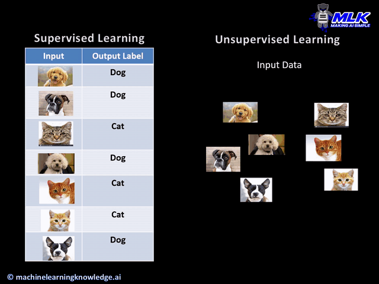

# Learning Algorithms

=======================

There are three main types of machine learning algorithms:

- _Supervised learning (SL):_
  These are algorithms that learn from a set of features (inputs) and corresponding labels (output). For instance a computer receives a set of foto's that are labeled either as 'orange' or 'apple' and is trained to distinguish between the two types of fruit.
- _Unsupervised learning (UL):_
  These algorithms learn from a set of features (inputs) only with the goal to discover patterns. For instance a computer receives a set of documents and is asked to find sets of different topics.
  

  

  

- _Reinforcement learning (RL):_
  The algorithms learn from rewards and punishment while taking actions. For instance a computer can be trained to play a computer game.

    <iframe width="560" height="315" src="https://www.youtube.com/embed/CI3FRsSAa_U" frameborder="0" allow="accelerometer; autoplay; clipboard-write; encrypted-media; gyroscope; picture-in-picture" allowfullscreen></iframe>

In the next few paragraphs we will briefly look at a few algorithms for unsupervised and reinforcement learning and provide some coding examples. Through the remainder of the course we will mainly work with neural networks for supervised learning. In the last paragraph we'll introduce neural networks and see how they perform compared to traditional methods.
